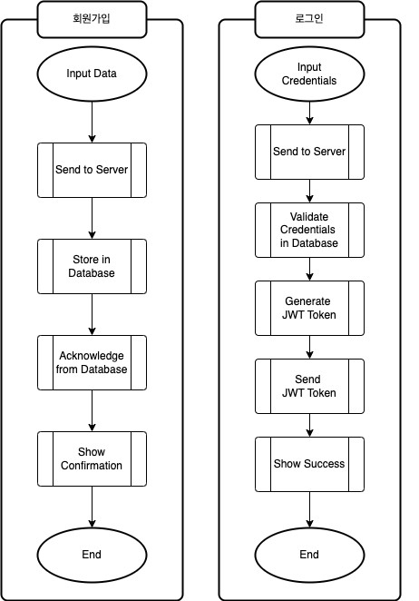
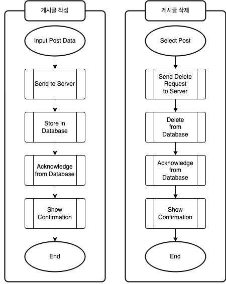
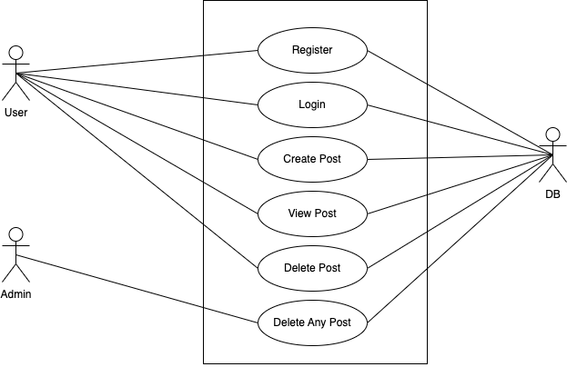
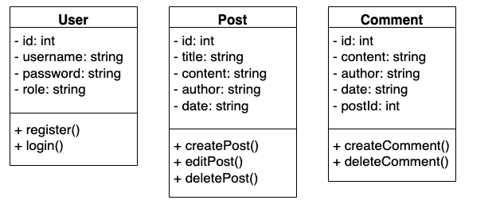

# 프로젝트 이름

프로젝트 설명을 여기에 작성합니다.

## 기술 스택

- **프론트엔드**: HTML, CSS, JavaScript
- **백엔드**: Node.js, Express.js
- **데이터베이스**: MySQL
- **기타**: JWT, bcrypt, dotenv, AJAX, Local Storage

## 시스템 구조

![System Architecture (https://raw.githubusercontent.com/shCHO9801/HTML_Mini_Project/main/UML%20image/%EC%9B%B9%20%EA%B2%8C%EC%8B%9C%ED%8C%90%20%EC%8B%9C%EC%8A%A4%ED%85%9C%20%EA%B5%AC%EC%A1%B0.png)

## 주요 기능 및 워크플로우

### 회원가입 및 로그인 워크플로우

#### 회원가입, 로그인 순서도

### 게시글 작성 및 삭제 워크플로우

## UML 다이어그램

### Use Case Diagram

### Class Diagram

## 결과 및 결론

- 사용자 인증 및 권한 관리 기능이 있는 동적인 게시판 웹 애플리케이션 개발 완료
- 기본적인 게시글 작성, 수정, 삭제 기능 구현
- 사용자 인증 및 권한 관리, 게시글 상세 보기 기능 구현

## 향후 개발 방향

- 반응형 디자인 구현
- 알림 기능 추가
- 프로필 관리
- 검색 및 필터링 기능 추가
- 소셜 로그인 추가
- 데이터 시각화 도구 추가
- 댓글 기능 추가

